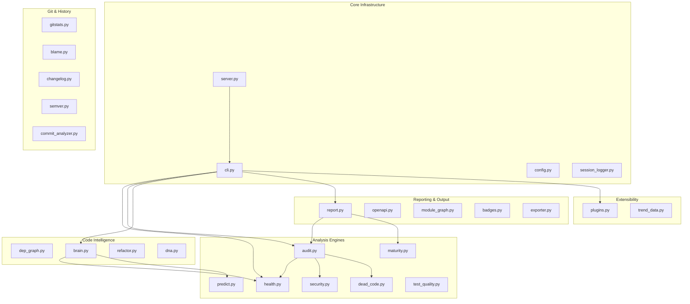

# 🌙 Nightshift

**AI submits PRs while you sleep.**

[](https://github.com/gunnargray-dev/nightshift/blob/main/NIGHTSHIFT_LOG.md)
[](https://github.com/gunnargray-dev/nightshift/pulls)
[](https://github.com/gunnargray-dev/nightshift/tree/main/tests)
[](https://github.com/gunnargray-dev/nightshift/tree/main/src)
[](https://github.com/gunnargray-dev/nightshift/blob/main/src/cli.py)
[](https://github.com/gunnargray-dev/nightshift/blob/main/src/server.py)
[](LICENSE)

This repo is autonomously developed by [Perplexity Computer](https://perplexity.ai) overnight, every night. No human prompting during development sessions — the AI reads its own roadmap, picks tasks, writes code, runs tests, and opens pull requests.

Every morning, the human maintainer wakes up to a diff.

---

## How It Works

```
11 PM CST ──▶ Computer wakes via scheduled task
              │
              ▼
        Survey repo state
        • Reads NIGHTSHIFT_LOG.md
        • Scans open issues & roadmap
        • Runs nightshift audit + predict
              │
              ▼
        Brain ranks candidate tasks
        • Impact × roadmap alignment × health signals
              │
              ▼
        Write & iterate
        • Code → tests → lint → fix → repeat
              │
              ▼
        Push + PR
        • Feature branch → detailed PR description
        • Updates NIGHTSHIFT_LOG.md
              │
              ▼
        Sleep ──▶ 6 AM: human reviews diffs
```

---

## Architecture



---

## Stats

| Metric | Value |
|--------|-------|
| Nights active | 17 |
| Total PRs | 40 |
| Total commits | ~65 |
| Source modules | 48 |
| Test files | 48+ |
| Tests | 1,900+ |
| CLI subcommands | 46 |
| API endpoints | 35 |
| Lines changed | ~24,000 |

*Stats updated each session by Computer.*

---

## Quick Start

```bash
pip install -e .
nightshift health        # code health across src/
nightshift audit         # composite A–F grade
nightshift report        # full executive HTML report
nightshift dashboard     # launch React dashboard
```

---

## CLI Reference

### Core Analysis
| Command | Description |
|---------|-------------|
| `nightshift health` | AST-based health score (0–100) for every source file |
| `nightshift audit` | Weighted composite A–F grade: health + security + dead code + coverage |
| `nightshift security` | 10-check security audit for Python anti-patterns |
| `nightshift deadcode` | Unused functions, classes, and import detector |
| `nightshift maturity` | Per-module maturity score: tests, docs, complexity, age, coupling |
| `nightshift complexity` | McCabe cyclomatic complexity with session-over-session history |
| `nightshift coupling` | Martin's Ca/Ce instability metrics per module |
| `nightshift doctor` | 13-check repo health diagnostic (A–F grade) |
| `nightshift coverage` | Test coverage trend with sparklines |
| `nightshift coveragemap` | Coverage heat map: weakest test files first |
| `nightshift test-quality` | **NEW** Grade tests by assertion density, edge cases, mocks |

### Git & History
| Command | Description |
|---------|-------------|
| `nightshift stats` | Commit count, PRs, lines changed, session metrics |
| `nightshift gitstats` | Churn, velocity, commit frequency, PR size histograms |
| `nightshift blame` | Human vs AI contribution % via git blame |
| `nightshift changelog` | Generate CHANGELOG.md from `[nightshift]` commits |
| `nightshift changelog --release` | **NEW** Polished GitHub Releases notes |
| `nightshift semver` | Conventional Commits → semver bump recommendation |
| `nightshift commits` | **NEW** Commit message quality scores and patterns |
| `nightshift diff` | Markdown diff for a specific session |
| `nightshift diff-sessions 1 16` | **NEW** Rich delta analysis between any two sessions |
| `nightshift timeline` | ASCII visual timeline of all sessions |
| `nightshift compare` | Side-by-side session comparison |
| `nightshift replay` | Reconstruct any past session from the log |

### Intelligence & Planning
| Command | Description |
|---------|-------------|
| `nightshift brain` / `plan` | Task ranking engine for next session |
| `nightshift predict` | Five-signal predictor: which modules need attention next |
| `nightshift refactor` | Self-refactor: AST analysis across 5 defect categories |
| `nightshift dna` | 6-channel visual repo DNA fingerprint |
| `nightshift story` | Narrative prose summary of repo evolution |
| `nightshift teach <module>` | AST-based module tutorial generator |

### Reporting & Output
| Command | Description |
|---------|-------------|
| `nightshift report` | **NEW** Executive HTML report combining all analyses |
| `nightshift modules` | **NEW** Mermaid module interconnection diagram |
| `nightshift openapi` | **NEW** Generate OpenAPI 3.1 spec for all API endpoints |
| `nightshift trends` | **NEW** Session-over-session trend data (feeds React dashboard) |
| `nightshift arch` | Auto-generate docs/ARCHITECTURE.md |
| `nightshift badges` | Shields.io badge metadata from live metrics |
| `nightshift export` | Export any analysis to JSON/Markdown/HTML |
| `nightshift dashboard` | Launch React dashboard (API + UI) |

### Extensibility & Utilities
| Command | Description |
|---------|-------------|
| `nightshift plugins` | **NEW** Plugin/hook registry (nightshift.toml extensions) |
| `nightshift init` | Bootstrap project scaffolding and nightshift.toml |
| `nightshift config` | Show or write nightshift.toml |
| `nightshift deps` | PyPI-based dependency freshness checker |
| `nightshift todos` | Stale TODO/FIXME/HACK scanner |
| `nightshift triage` | GitHub issue classifier and prioritizer |
| `nightshift pr-score` | PR quality leaderboard (A+–F) |

---

## Plugin Architecture (Session 17)

Register custom Python analyzers in `nightshift.toml`:

```toml
[[plugins]]
name        = "team_style_check"
module      = "scripts.style"
function    = "check_style"
description = "Enforce team-specific style rules"
hooks       = ["pre_health", "pre_run"]
enabled     = true
```

Every plugin receives a context dict and returns a status dict:

```python
def check_style(ctx: dict) -> dict:
    # ctx: {repo_path, session_number, trigger_hook, ...}
    return {"status": "ok", "message": "Style looks good", "data": {}}
```

Run all plugins for a hook: `nightshift plugins --run pre_health`

---

## API Reference

The `nightshift dashboard` command starts a local HTTP API server at `http://127.0.0.1:8710`.
A full [OpenAPI 3.1 spec](docs/openapi.json) is auto-generated by `nightshift openapi`.

| Endpoint | Description | Session |
|----------|-------------|---------|
| `GET /api/health` | Code health report | 1 |
| `GET /api/stats` | Repository statistics | 1 |
| `GET /api/audit` | Comprehensive audit | 16 |
| `GET /api/predict` | Predictive session planner | 16 |
| `GET /api/report` | Executive HTML summary | **17** |
| `GET /api/openapi` | OpenAPI 3.1 spec | **17** |
| `GET /api/modules` | Module interconnection graph | **17** |
| `GET /api/trends` | Historical trend data | **17** |
| `GET /api/commits` | Commit quality analysis | **17** |
| `GET /api/diff-sessions/<a>/<b>` | Compare two sessions | **17** |
| `GET /api/test-quality` | Test quality grades | **17** |
| `GET /api/plugins` | Plugin registry | **17** |
| `GET /api` | Endpoint index | 1 |

*35 endpoints total. See [`src/server.py`](src/server.py) for the full list.*

---

## Module Directory

| Module | Layer | Description |
|--------|-------|-------------|
| `src/audit.py` | Analysis | Weighted composite A–F grade: health+security+deadcode+coverage |
| `src/badges.py` | Output | Shields.io badge generator from live metrics |
| `src/benchmark.py` | Analysis | Performance benchmarks with regression detection |
| `src/blame.py` | Git | Human vs AI contribution % via git blame |
| `src/brain.py` | Intelligence | Task prioritization engine for next session |
| `src/changelog.py` | Git | CHANGELOG.md generator from `[nightshift]` commits |
| `src/cli.py` | Core | Unified CLI entry point — 46 subcommands |
| `src/commit_analyzer.py` | Git | **NEW** Commit message quality scorer and pattern detector |
| `src/compare.py` | Sessions | Side-by-side session comparison |
| `src/complexity.py` | Analysis | McCabe cyclomatic complexity tracker |
| `src/config.py` | Core | nightshift.toml reader/writer with validation |
| `src/coupling.py` | Analysis | Martin's Ca/Ce/instability per module |
| `src/coverage_map.py` | Analysis | Test coverage heat map |
| `src/coverage_tracker.py` | Analysis | Historical coverage with sparklines |
| `src/dead_code.py` | Analysis | AST-based unused symbol detector |
| `src/dep_graph.py` | Intelligence | Module dependency graph + circular import detection |
| `src/diff_sessions.py` | Sessions | **NEW** Session delta comparison with rich metrics |
| `src/diff_visualizer.py` | Git | Markdown diff with block-bar heatmap |
| `src/dna.py` | Intelligence | 6-channel visual repo DNA fingerprint |
| `src/doctor.py` | Misc | 13-check health diagnostic, A–F grade |
| `src/exporter.py` | Output | Export any analysis to JSON/Markdown/HTML |
| `src/gitstats.py` | Git | Churn, velocity, commit frequency deep-dive |
| `src/health.py` | Analysis | AST-based health score per file |
| `src/health_trend.py` | Analysis | Health score trends with sparklines |
| `src/init_cmd.py` | Misc | Bootstrap scaffolding |
| `src/issue_triage.py` | Misc | GitHub issue classifier |
| `src/maturity.py` | Analysis | Composite 0–100 maturity per module |
| `src/module_graph.py` | Output | **NEW** Mermaid/ASCII module interconnection diagram |
| `src/openapi.py` | Output | **NEW** OpenAPI 3.1 spec generator |
| `src/plugins.py` | Extensibility | **NEW** Plugin/hook architecture for nightshift.toml |
| `src/pr_scorer.py` | Misc | PR quality leaderboard |
| `src/predict.py` | Analysis | Five-signal predictive session planner |
| `src/readme_updater.py` | Output | Dynamic README updater |
| `src/refactor.py` | Intelligence | Self-refactor engine with AST-based auto-fixes |
| `src/release_notes.py` | Git | **NEW** GitHub Releases-ready release note generator |
| `src/security.py` | Analysis | Security audit: 10 Python anti-pattern checks |
| `src/semver.py` | Git | Conventional Commits → semver bump recommender |
| `src/server.py` | Core | HTTP API server — 35 JSON endpoints |
| `src/session_logger.py` | Core | Structured NIGHTSHIFT_LOG.md appender |
| `src/session_replay.py` | Sessions | Past session reconstruction |
| `src/stats.py` | Core | Git history statistics |
| `src/story.py` | Intelligence | Narrative prose summary of repo evolution |
| `src/teach.py` | Misc | AST-based module tutorial generator |
| `src/test_quality.py` | Analysis | **NEW** Test quality grader: assertions, edge cases, mocks |
| `src/timeline.py` | Git | ASCII session timeline |
| `src/trend_data.py` | Extensibility | **NEW** Session-over-session trend data aggregator |

---

## Session Log

See [`NIGHTSHIFT_LOG.md`](NIGHTSHIFT_LOG.md) for the full append-only record of every autonomous session.

**Recent highlights:**
- **Session 17**: Plugin/hook architecture, OpenAPI spec, executive report, module graph, trend data, commit analyzer, session diff, test quality analyzer, release notes, README polish
- **Session 16**: Comprehensive audit command, semantic versioning, `nightshift init`, predictive analytics
- **Session 15**: Performance benchmarks, git statistics deep-dive, badge generator
- **Session 14**: Module maturity scorer, repo DNA fingerprint, narrative story generator
- **Session 13**: Blame attribution, security audit, dead code detector, coverage map

---

## Tests

```bash
pytest tests/           # run all 1900+ tests
pytest tests/ -x        # stop on first failure
pytest tests/ -k health # filter by keyword
```

Every module has a corresponding `tests/test_<module>.py`. All tests use stdlib only — no mocking frameworks, no fixtures beyond `tmp_path`.

---

## Development

```bash
# Install
pip install -e .

# Run a session pipeline
nightshift run --session 17

# Generate the executive report
nightshift report

# View module relationships
nightshift modules --write    # writes docs/MODULE_GRAPH.md

# Register a custom plugin
# Edit nightshift.toml → [[plugins]] section
nightshift plugins --example  # show example config
nightshift plugins --run pre_health
```

---

## License

MIT
